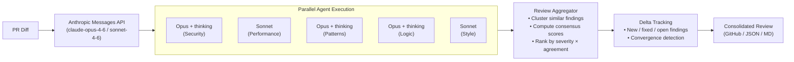

# AI Code Reviewer

**Multi-agent code review system that orchestrates multiple LLMs to produce comprehensive, consensus-based code reviews.**

[](https://opensource.org/licenses/MIT)

---

## Overview

AI Code Reviewer takes a different approach to automated code review: instead of relying on a single model, it orchestrates **multiple specialized agents** that review code from different perspectives — security, performance, and code quality — then combines their findings into a unified, confidence-scored review.

### Key Features

- **Multi-Agent Architecture**: Run 2–5+ LLM agents in parallel, each with a specialized focus area
- **Consensus-Based Scoring**: Findings are weighted by how many agents agree, reducing false positives
- **Anthropic Messages API**: All models (Claude Opus 4.6, Sonnet 4.6) accessed directly via the official `anthropic` SDK, with prompt caching, extended thinking, and tool use
- **GitHub Integration**: Automatic PR reviews via webhooks, with inline comments and thread resolution
- **Incremental Reviews**: Delta tracking detects new, fixed, and open findings across pushes — with convergence logic that stops reviewing when findings stabilize
- **Documentation Review**: Rule-based check that flags missing doc updates on architecture-impacting PRs — works out-of-the-box on any repo by probing for `CLAUDE.md`, `AGENTS.md`, and architecture folders (zero LLM cost)

For the full technical deep-dive — pipeline flowcharts, scoring formulas, convergence state machine, and prompt engineering — see the **[Architecture Documentation](docs/ARCHITECTURE.md)**.

---

## Quick Start

```bash
# Install
pip install ai-code-reviewer

# Export credentials
export ANTHROPIC_API_KEY=sk-ant-...
export GITHUB_TOKEN=ghp_...

# Review a GitHub PR
ai-reviewer review-pr calimero-network/core 123

# Review a local diff
git diff main | ai-reviewer review --output markdown
```

---

## How It Works

All LLM agents call Anthropic's Messages API directly via the official `anthropic` SDK. Reasoning-heavy agents run on `claude-opus-4-6` with extended thinking; broader agents run on `claude-sonnet-4-6`. Repo exploration happens through Claude tool use (`read_file` / `glob` / `grep`) backed by the GitHub Contents API — no cloning, no extra infrastructure.



For a detailed breakdown of the pipeline, scoring formulas, and convergence logic, see the **[Architecture Documentation](docs/ARCHITECTURE.md)**.

---

## Configuration

Create `config.yaml`:

```yaml
anthropic:
  api_key: ${ANTHROPIC_API_KEY}
  default_model: claude-opus-4-6
  enable_prompt_caching: true

github:
  token: ${GITHUB_TOKEN}  # or Classic PAT for thread resolution (see below)

agents:
  - name: security-reviewer
    model: claude-opus-4-6
    focus_areas: [security, architecture]
    thinking_enabled: true
    thinking_budget_tokens: 8192

  - name: performance-reviewer
    model: claude-sonnet-4-6
    focus_areas: [performance, logic]

  - name: patterns-reviewer
    model: claude-opus-4-6
    focus_areas: [consistency, patterns]
    thinking_enabled: true
    allow_tool_use: true
    max_tool_calls: 30

orchestrator:
  timeout_seconds: 300
  min_agents_required: 2

# Documentation review (rule-based, no LLM cost)
doc_review:
  enabled: true
  architecture_paths: ["architecture/", "docs/", "doc/"]
  convention_files: ["AGENTS.md", "CLAUDE.md", "CONTRIBUTING.md"]
```

---

## CLI Commands

```bash
# Review a GitHub PR (includes doc review by default)
ai-reviewer review-pr <owner/repo> <pr-number>

# Skip documentation review
ai-reviewer review-pr <owner/repo> <pr-number> --no-doc-check

# Force documentation review even if disabled in config
ai-reviewer review-pr <owner/repo> <pr-number> --doc-check

# Start webhook server
ai-reviewer serve --port 8080

# Configuration
ai-reviewer config validate
ai-reviewer config show
```

---

## Output Example

```
Reviewed by 3 agents  |  Quality score: 87%

CRITICAL (1)
  SQL Injection in auth/login.py:45  [3/3 agents]
  User input interpolated directly into SQL query without parameterization.

WARNING (2)
  Missing rate limiting on /api/login  [2/3 agents]
  Inefficient O(n²) loop in process_batch()  [2/3 agents]

SUGGESTION (3)
  Add type hints to process_user()
  Extract magic number 86400 to a named constant
  Add docstring to AuthHandler
```

---

## Repository Configuration

Add `.ai-reviewer.yaml` to the root of any reviewed repository to customize behavior:

```yaml
# Exclude generated or vendored files from review
ignore:
  - "**/*.generated.rs"
  - "**/vendor/**"

# Append custom instructions to a specific agent's prompt
agents:
  - name: security-reviewer
    custom_prompt_append: |
      This is a Rust codebase using eyre for errors.
      Flag all unwrap() calls.

# Review policy
policy:
  require_human_review_for: [security]
  block_on_critical: true
```

---

## GitHub Actions Setup

### Basic Setup (`GITHUB_TOKEN`)

The default `GITHUB_TOKEN` provided by GitHub Actions is sufficient for most features:

- Posting reviews and inline comments
- Adding reactions
- Posting "Resolved" replies

It cannot resolve review threads (collapsing them in the UI), which requires a Classic PAT.

### Full Features (Classic Personal Access Token)

> **Note:** Fine-grained PATs do not support the `resolveReviewThread` GraphQL mutation. Use a Classic PAT with `repo` scope.

1. Create a [Classic Personal Access Token](https://github.com/settings/tokens/new) with the `repo` scope.

2. Add it as a repository secret named `GH_PAT`:
   ```
   Settings → Secrets and variables → Actions → New repository secret
   Name: GH_PAT
   Value: ghp_xxxxxxxxxxxxxxxxxxxx
   ```

3. The workflow uses `GH_PAT` automatically when present, falling back to `GITHUB_TOKEN`.

For production deployments, prefer a dedicated service account and rotate tokens regularly. GitHub Apps with fine-grained permissions are the recommended long-term approach.

---

## Development

```bash
git clone https://github.com/calimero-network/ai-code-reviewer
cd ai-code-reviewer

pip install -e ".[dev]"

pytest
ruff check .
mypy src/
```

---

## AI Rules & Documentation

The repository ships structured AI context to help coding assistants work with the codebase effectively.

```
.ai/
├── context.md           # Codebase overview — read first
├── doc-bot.md           # Documentation bot instructions
├── prompts/             # Reusable AI prompts
└── rules/               # Per-module design rules
    ├── architecture.md  # High-level design & invariants
    ├── agents.md        # Agent module patterns
    ├── orchestrator.md  # Orchestration rules
    ├── github.md        # GitHub integration patterns
    ├── models.md        # Data model conventions
    └── conventions.md   # Coding style guide
```

The `review-pr` command includes a built-in documentation review that runs alongside the AI code review. It detects architecture-impacting changes (new modules, manifest edits, CI changes, infrastructure files) and checks whether convention files like `CLAUDE.md` or `AGENTS.md` were updated. For repos with `.ai-reviewer.yaml`, it also checks explicit `source_to_docs_mapping` rules. The check is rule-based (no LLM calls) and posts a separate PR comment with suggestions. Disable with `--no-doc-check` or `doc_review.enabled: false` in config.

---

## Related Projects

- [ai-bounty-hunter](https://github.com/calimero-network/ai-bounty-hunter) - Automatic bounty fixing
- [pr-agent](https://github.com/Codium-ai/pr-agent) - Single-agent PR reviews
- [SWE-agent](https://github.com/SWE-agent/SWE-agent) - GitHub issue automation

---

## License

MIT License - see [LICENSE](LICENSE) for details.

---

<sub>Built with ❤️ by [Calimero Network](https://github.com/calimero-network)</sub>
