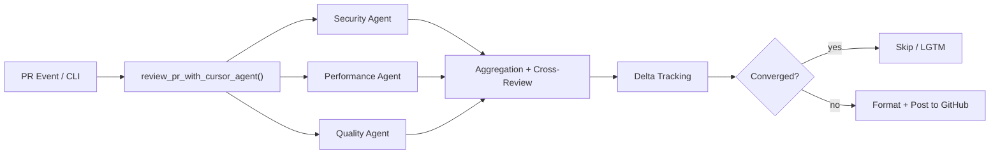
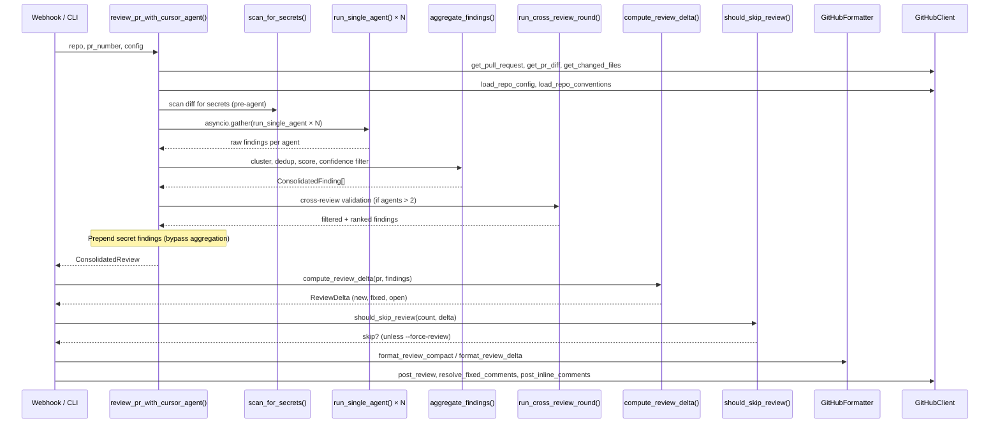
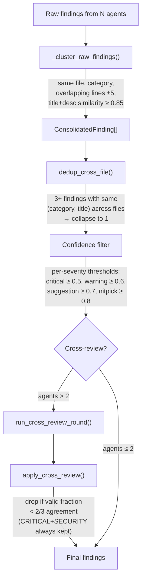
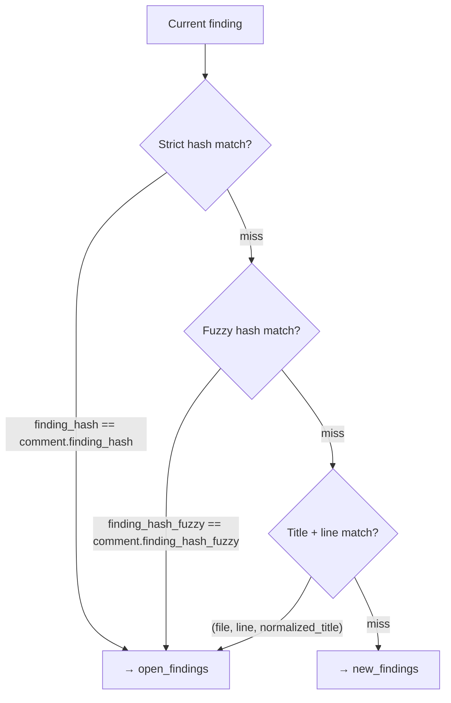
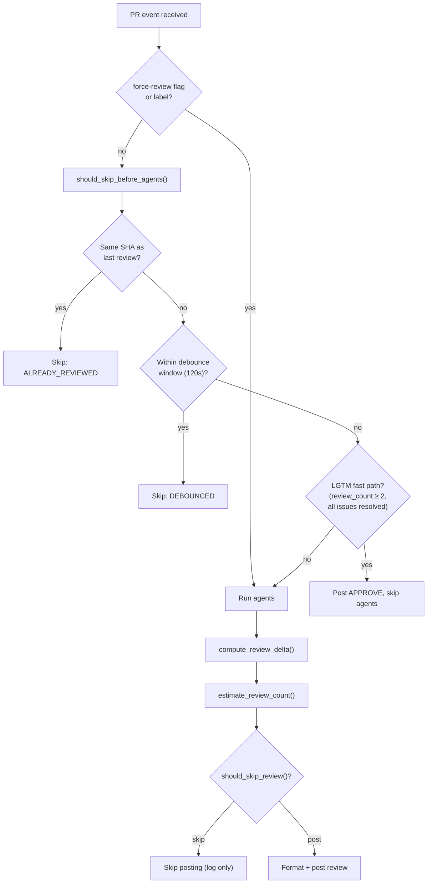

# Architecture Documentation

> Comprehensive technical reference for the AI Code Reviewer system.
> For a quick overview, see the [README](../README.md).

## Table of Contents

1. [System Overview](#1-system-overview)
2. [Review Pipeline](#2-review-pipeline)
3. [Multi-Agent Consensus](#3-multi-agent-consensus)
4. [Scoring System](#4-scoring-system)
5. [Incremental Review (Delta Tracking)](#5-incremental-review-delta-tracking)
6. [Convergence and "Stop Reviewing" Logic](#6-convergence-and-stop-reviewing-logic)
7. [Prompt Engineering](#7-prompt-engineering)
8. [Security](#8-security)
9. [Phase Roadmap](#9-phase-roadmap)

---

## 1. System Overview

AI Code Reviewer orchestrates multiple LLM agents — each with a specialized focus area — to produce consensus-based code reviews. All LLM access goes through the Cursor Background Agent API; there are no direct provider SDK dependencies.



### Module Map

| Module | Responsibility |
|--------|----------------|
| `cli.py` | Click CLI: `review-pr`, `config validate/show`, `serve` (uvicorn webhook) |
| `config.py` | YAML/env `Config` dataclasses, `load_config`, `validate_config` |
| `review.py` | Main pipeline: agent configs, prompts, aggregation, cross-review, `review_pr_with_cursor_agent` |
| `models/context.py` | `ReviewContext` dataclass for PR/repo metadata and repo config hooks |
| `models/findings.py` | `Severity`, `Category`, `ReviewFinding`, `ConsolidatedFinding`, `compute_fuzzy_hash` |
| `models/review.py` | `ReviewHistory`, `ScoreBreakdown`, `AgentReview`, `ConsolidatedReview` |
| `agents/cursor_client.py` | `CursorClient` / `CursorConfig`: HTTP client for Cursor Background Agent API |
| `agents/base.py` | `ReviewAgent` ABC (alternate agent path, not used by main Cursor flow) |
| `agents/security.py` | `SecurityAgent` subclass of `ReviewAgent` |
| `agents/performance.py` | `PerformanceAgent` subclass |
| `agents/patterns.py` | `PatternsAgent` subclass |
| `orchestrator/orchestrator.py` | Generic parallel `AgentOrchestrator` (asyncio tasks) |
| `orchestrator/aggregator.py` | `ReviewAggregator` clustering/merge (alternate path; production uses `aggregate_findings` in `review.py`) |
| `security/scanner.py` | Regex + Shannon entropy secret scanner on unified diffs |
| `github/client.py` | `GitHubClient`, delta/convergence, inline comments, metadata, thread resolution |
| `github/formatter.py` | `GitHubFormatter`: markdown bodies, compact/delta layouts, review actions, JSON export |
| `github/webhook.py` | FastAPI app, HMAC verification, PR + `/ai-review` comment handlers |

---

## 2. Review Pipeline

### Entry Points

| Entry | Function | Path |
|-------|----------|------|
| **CLI** | `review_pr` → `review_pr_async()` | `cli.py` |
| **Webhook** | `handle_pr_event` → `default_review_handler` | `github/webhook.py` |
| **Serve** | `cli serve` starts uvicorn with the webhook app | `cli.py` |

### Sequence Diagram



### Key Functions

- **`review_pr_with_cursor_agent()`** (`review.py`): Core orchestration. Fetches PR data, builds context, spawns agents in parallel, aggregates, cross-reviews, prepends secret findings, returns `ConsolidatedReview`.
- **`run_single_agent()`** (`review.py`): Sends a prompt to one Cursor Background Agent, parses JSON response into findings.
- **`aggregate_findings()`** (`review.py`): Clusters raw findings by similarity, computes consensus scores, applies confidence filtering and cross-file dedup.
- **`default_review_handler()`** (`webhook.py`): Webhook's async handler — includes pre-agent skip checks, LGTM fast path, metadata embedding, and the full post flow.

---

## 3. Multi-Agent Consensus

### Agent Spawning

Production uses **parallel `asyncio.gather`** of `run_single_agent()`, each configured from `AGENT_CONFIGS`:

| Agent | Focus | Prompt Specialization |
|-------|-------|-----------------------|
| `security-agent` | Security | OWASP Top 10, injection, auth, crypto, secrets |
| `performance-agent` | Performance + Correctness | Algorithmic complexity, resource leaks, concurrency |
| `quality-agent` | Maintainability | SOLID, DRY, KISS, YAGNI, API design, error handling |

Agent count is adaptive: `_effective_agent_count()` scales 1–3 agents based on PR size. Cross-review is auto-skipped when ≤ 2 agents run.

### Aggregation Pipeline



**Clustering** (`_cluster_raw_findings`): Groups findings that share the same file, category, overlapping line ranges (±5 lines), and combined title+description similarity ≥ 0.85 (character-level `SequenceMatcher`). Each cluster becomes one `ConsolidatedFinding` with `consensus_score = unique_agents_in_cluster / total_agents`.

**Cross-file dedup** (`dedup_cross_file`): When 3+ findings share the same `(category, title)` across different files, they collapse into a single finding with an "Also found in: ..." annotation.

**Cross-review validation** (`run_cross_review_round` → `apply_cross_review`): A second-pass LLM call where agents validate each other's findings. Findings with < 2/3 validation agreement are dropped — except `CRITICAL` severity + `SECURITY` category findings, which always bypass this filter.

---

## 4. Scoring System

### `compute_quality_score()`

Located in `review.py`. Returns a `float` between 0.0 and 0.95 along with a `ScoreBreakdown`.

#### When findings exist

```
severity_weights = {CRITICAL: 0.20, WARNING: 0.06, SUGGESTION: 0.02, NITPICK: 0.005}

severity_penalty = Σ (weight[f.severity] × f.confidence)  for each finding f
density_penalty  = min(0.15, (len(findings) / max(total_lines/100, 1)) × 0.03)
consensus_factor = 0.8 + mean(f.consensus_score) × 0.2
agent_factor     = min(1.0, agent_count / 3)

raw_score = max(0, 1 - severity_penalty - density_penalty)
final     = min(0.95, round(raw_score × consensus_factor × agent_factor, 2))
```

#### Clean review (no findings)

```
raw_score    = 0.85
agent_bonus  = max(0, min(0.10, (agent_count - 1) × 0.05))
agent_factor = (raw_score + agent_bonus) / raw_score
final        = min(0.95, raw_score × agent_factor)
```

### `ScoreBreakdown`

```python
@dataclass
class ScoreBreakdown:
    severity_penalty: float
    density_penalty: float
    consensus_factor: float
    agent_factor: float
    raw_score: float
```

Displayed in the review footer as a collapsed `<details>` section so reviewers can understand how the score was derived.

---

## 5. Incremental Review (Delta Tracking)

### `ReviewDelta`

```python
@dataclass
class ReviewDelta:
    new_findings: list[ConsolidatedFinding]    # Not seen before
    fixed_findings: list[PreviousComment]       # Previously reported, now resolved
    open_findings: list[ConsolidatedFinding]    # Still present from prior review
    previous_comments: list[PreviousComment]    # All prior AI review comments

    @property
    def all_issues_resolved(self) -> bool:
        return len(self.open_findings) == 0 and len(self.new_findings) == 0
```

### Three-Tier Matching in `compute_review_delta()`

Each current finding is matched against previous inline comments using a three-tier cascade:



| Tier | Hash Key | Stable Across |
|------|----------|---------------|
| **Strict** | `SHA256(file_path:line_start:normalized_title)[:12]` | Same file, line, title |
| **Fuzzy** | `SHA256(file_path:sorted_keywords_4+_chars)[:12]` | Line shifts, title rewording |
| **Legacy** | `(file_path, line, normalized_title)` tuple | Fallback for pre-hash comments |

Unmatched previous comments become `fixed_findings`.

### Severity Stabilization

`stabilize_severity(current, previous, review_count)` prevents severity flip-flopping:

- **Upgrades** (more severe) are always allowed.
- **Downgrades** are blocked after 2+ reviews at the higher severity.
- Applied during `compute_review_delta()` when a finding matches a previous comment.

### Finding ID Embedding

Each inline comment includes an HTML comment for future matching:

```
<!-- ai-reviewer-id: {finding.finding_hash} -->
```

Parsed by `_parse_review_comment()` on subsequent reviews to build the `PreviousComment.finding_hash` field.

### Review Metadata

Top-level review comments embed structured metadata:

```
<!-- ai-reviewer-meta: {"review_count": 2, "commit_sha": "abc123", "timestamp": "..."} -->
```

Used by `should_skip_before_agents()` for same-SHA detection and debouncing, and by `check_lgtm_fast_path()` for the LGTM approval path.

---

## 6. Convergence and "Stop Reviewing" Logic

The convergence system prevents redundant reviews when findings have stabilized.

### Decision Flowchart



### Functions

| Function | Location | Logic |
|----------|----------|-------|
| `has_converged(delta)` | `github/client.py` | `True` when `new_findings == 0` and `fixed_findings == 0` |
| `should_skip_review(count, delta)` | `github/client.py` | Never skip first review; skip if converged on 2nd+; on 3rd+, also skip if only new findings are all NITPICK |
| `estimate_review_count(delta)` | `github/client.py` | 1 if no previous comments; else `max(2, len(previous_comments) // 3 + 1)` |
| `should_skip_before_agents(meta, sha, force)` | `github/client.py` | Same-SHA → `ALREADY_REVIEWED`; within debounce → `DEBOUNCED` |
| `check_lgtm_fast_path(meta, delta)` | `github/client.py` | `review_count ≥ 2`, empty findings delta, `all_issues_resolved` |

### Overrides

- **CLI**: `--force-review` flag bypasses all convergence checks.
- **GitHub**: `force-review` label on the PR triggers a full review regardless of convergence state.

---

## 7. Prompt Engineering

### PR Classification

`classify_pr(changed_paths, additions, deletions)` returns `(pr_type, size)`:

| Type | Detection |
|------|-----------|
| `docs` | All files are `.md`, `.rst`, `.txt`, or under `docs/` |
| `ci` | All files under `.github/`, `.circleci/`, etc. |
| `code` | Everything else |

| Size | Threshold (additions + deletions) |
|------|-----------------------------------|
| `trivial` | < 50 lines |
| `small` | 50–199 lines |
| `medium` | 200–999 lines |
| `large` | ≥ 1000 lines |

Size-adaptive instructions are injected into the prompt:
- **trivial/small**: "Be extra precise — only flag genuine issues. Do not pad with low-value suggestions."
- **large**: "Focus on architectural concerns and high-severity issues first. Ignore minor style."

### Language-Specific Rules

`_LANGUAGE_RULES` dict provides per-language guidance injected via `get_language_rules()`:

| Language | Key Rules |
|----------|-----------|
| **Python** | Mutable default args, bare `except`, missing type hints, f-string injection in logging, `subprocess shell=True` |
| **Rust** | `.unwrap()` in non-test code, `unsafe` without `// SAFETY:`, unnecessary `.clone()`, unbounded allocations |
| **JavaScript** | Prototype pollution, `==` vs `===`, unhandled Promise rejections, `eval()`/`innerHTML` |
| **TypeScript** | `any` type escapes, missing error boundaries, `@ts-ignore` without justification |
| **Go** | Unchecked errors, SQL string concatenation, goroutine leaks, missing `defer` |

### Repo-Aware Prompts

- **`.ai-reviewer.yaml`**: `load_repo_config()` fetches the config from the target repo. `custom_rules` are injected as a "Repository-Specific Rules" section. `ignore` patterns filter files from the diff before agents see them.
- **Convention files**: `load_repo_conventions()` best-effort loads `AGENTS.md`, `CLAUDE.md`, `CONTRIBUTING.md`, `.cursor/rules/README.md` (capped at 3k chars total) and injects them as a "Repository Conventions" section.
- **PR metadata**: Title, description, base/head branches, changed file list, and detected languages are included in every prompt.

### Few-Shot Examples

`get_output_format()` includes good and bad finding examples to calibrate agent output quality:

- **Good**: Specific file, line, severity, actionable title and description.
- **Bad**: Vague "consider adding more tests" style findings explicitly marked as what NOT to produce.

---

## 8. Security

### Secret Detection Pre-Scan

`scan_for_secrets()` in `security/scanner.py` runs synchronously before agents are spawned. It scans added lines in the unified diff using two methods:

1. **Regex patterns** (`SECRET_PATTERNS`): 10+ compiled patterns covering AWS keys, GitHub tokens (PAT, OAuth, App, Fine-Grained), private keys, Slack tokens, generic API keys/secrets, database connection strings, and JWT tokens.

2. **Shannon entropy analysis**: Strings ≥ 20 characters with entropy ≥ 4.5 bits/char are flagged as potential high-entropy secrets (base64-encoded keys, random tokens).

Secret findings are created as `ConsolidatedFinding` with `severity=CRITICAL` and `category=SECURITY`. They **bypass aggregation and cross-review** entirely — they are prepended directly to the final findings list.

The `.ai-reviewer.yaml` config supports `secret_scan_exclude` patterns to suppress false positives on known-safe paths.

### Critical Security Bypass in Cross-Review

In `apply_cross_review()`, findings with `severity == CRITICAL` and `category == SECURITY` are unconditionally kept regardless of cross-review validation scores. This prevents legitimate security findings from being filtered out by the consensus mechanism.

### Config Validation

`validate_config()` checks:
- Cursor API key is present and non-empty.
- GitHub token is present.
- At least one agent is configured.
- `min_agents_required` ≤ number of configured agents.

### Webhook Security

`verify_signature()` validates incoming webhook payloads using HMAC SHA-256 with the configured `GITHUB_WEBHOOK_SECRET`. The request body is read once and reused for both signature verification and JSON parsing.

---

## 9. Phase Roadmap

### Phase 1: Quick Wins — **Completed**

| # | Item | Section |
|---|------|---------|
| 1 | Confidence-based filtering | 2a |
| 2 | Adaptive agent count for small PRs | 2b |
| 3 | Enforce max_total/max_per_file from config | 5c |
| 4 | Secret detection pre-scan (regex + entropy) | 9a, 9b |
| 5 | Few-shot examples in prompt | 1d |
| 6 | Enhanced security agent prompt (OWASP) | 9d |
| 7 | Adaptive max findings per agent | 2c |
| 8 | Critical security bypass in cross-review | 9e |

### Phase 2: Medium Effort — **Completed**

| # | Item | Implementation Location |
|---|------|------------------------|
| 1 | Load `.ai-reviewer.yaml` from target repo | `client.py:load_repo_config()`, `load_repo_conventions()` |
| 2 | New quality scoring formula | `review.py:compute_quality_score()`, `models/review.py:ScoreBreakdown` |
| 3 | Multi-tier finding hash | `findings.py:compute_fuzzy_hash()`, `client.py:compute_review_delta()` 3-tier matching |
| 4 | Cross-file deduplication | `review.py:dedup_cross_file()` |
| 5 | Convergence detection | `client.py:has_converged()`, `should_skip_review()`, `estimate_review_count()` |
| 6 | Severity stabilization across runs | `client.py:stabilize_severity()` |
| 7 | PR size classification + adaptive prompts | `review.py:classify_pr()` |
| 8 | Language-specific prompt rules | `review.py:_LANGUAGE_RULES`, `get_language_rules()` |

### Phase 3: Architectural — **Planned**

| # | Item | Depends On | Effort |
|---|------|------------|--------|
| 1 | Commit-aware incremental diffing | P2-3 | 1 week |
| 2 | Large PR tiered review (architecture pass + hotspot detail) | — | 1 week |
| 3 | Embedding-based semantic similarity (`sentence-transformers`) | — | 1 week |
| 4 | Full `ReviewHistory` + re-open prevention | P2-3, P2-6 | 1 week |
| 5 | Score damping with rolling average | P2-2, P3-4 | 3 days |
| 6 | Consolidate dual aggregation paths | P2-2 | 3 days |

### Convergence Improvements (Phase 3 Focus)

The convergence system (Phase 2) provides the foundation. Phase 3 extends it with:

- **Review metadata embedding**: Richer `<!-- ai-reviewer-meta: {...} -->` with review count, commit SHA, and timestamp — enabling pre-agent convergence checks.
- **Pre-agent convergence check**: `should_skip_before_agents()` detects same-SHA and debounce scenarios before spending API calls on agents.
- **LGTM fast path**: When `review_count ≥ 2` and all issues are resolved, post an `APPROVE` review without running agents.
- **Debouncing**: Skip reviews within a configurable window (default 120s) of the last review on the same PR.
